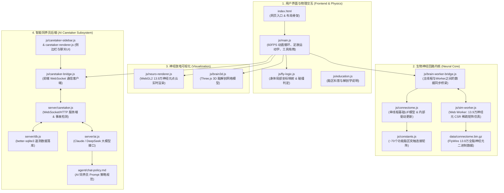

# FlyBrain 代码文件与功能映射图谱
# FlyBrain Codebase & Capability Mapping Guide

本文档详细梳理了 FlyBrain 项目中各个模块、代码文件与系统功能之间的对应关系与调用架构。

This document provides a comprehensive mapping between the codebase structure, architectural components, and system capabilities of FlyBrain.

---

## 1. 架构总览 (System Architecture)

FlyBrain 由 4 大核心子系统构成：
1. **生物神经模拟内核 (Neural Simulation Engine)**：从 ~70 个功能脑区模型到 13.9 万真实神经元的 LIF 仿真。
2. **果蝇物理身体与画布主循环 (Fly Body & Main Loop)**：基于 Canvas 的 60 FPS 物理渲染、三足步态与行为状态机。
3. **神经放电可视化 (Visualization Layer)**：WebGL2 13.9 万神经元点云与 Three.js 3D 脑解剖网格。
4. **AI 饲养员系统 (AI Caretaker Backend)**：全天候状态遥测记录 (SQLite) 与 Claude/DeepSeek 大模型对话。

---

## 2. 文件与功能映射表 (Detailed Capability Mapping)

### ① 生物神经模拟内核 (Neural Core)

| 文件路径 (File Path) | 核心功能职责 (Responsibilities) | 关键交互与调用 (Interactions) |
|---|---|---|
| [`js/constants.js`](../js/constants.js) | **突触连接权重矩阵**。定义了约 70 个功能神经元（`VIS_*`, `OLF_*`, `GUS_*`, `MECH_*`, `CX_*`, `SEZ_*`, `MN_*` 等）之间的兴奋性与抑制性连接强度。 | 被 `connectome.js` 读取用于构建神经突触网络，被单元测试严格校验。 |
| [`js/connectome.js`](../js/connectome.js) | **基础神经动力学模型**。实现膜电位累加（`dendriteAccumulate`）、LIF（漏电积分放电）、驱动值演化计算（`hunger`, `fear`, `fatigue`, `curiosity`, `groom`）。 | 读取 `constants.js`，将电机神经元信号传递给 `main.js` 控制果蝇动作。 |
| [`js/brain-worker-bridge.js`](../js/brain-worker-bridge.js) | **Worker 通信桥梁**。负责加载 `connectome.bin.gz`、启动后台 Web Worker，双向同步用户刺激与神经放电数据。 | 介于前端主线程与 `sim-worker.js` 之间。 |
| [`js/sim-worker.js`](../js/sim-worker.js) | **全脑 13.9 万神经元仿真 Worker**。在独立线程中采用 **CSR (Compressed Sparse Row) 稀疏矩阵** 与 **Neuropil 门控** 以 10Hz 实时仿真全部真实突触。 | 异步接收 Bridge 的刺激输入，输出神经元放电状态数组。 |
| [`data/connectome.bin.gz`](../data/connectome.bin.gz) | **全脑连接组二进制数据**。由普林斯顿大学 FlyWire FAFB v783 导出的 139,255 个神经元与 270 万条连接。 | 在页面启动时由 `sim-worker.js` 流式解压并映射为内存结构。 |

---

### ② 果蝇物理身体与主逻辑 (Fly Body & Main Loop)

| 文件路径 (File Path) | 核心功能职责 (Responsibilities) | 关键交互与调用 (Interactions) |
|---|---|---|
| [`index.html`](../index.html) | **页面入口与 DOM 结构**。组织工具栏（Feed, Touch, Air, Light, Temp）、主画布、仪表盘及侧边栏。 | 加载并协调所有前端 CSS 与 JS 脚本。 |
| [`js/main.js`](../js/main.js) | **主仿真循环与交互中枢**。 1. 60 FPS 物理渲染与动画（三足步态 Tripod Gait、复眼、口器伸缩、翅膀拍打）。 2. 交互事件处理（放置食物、拖拽风向、点击触碰）。 3. 行为状态机调度（`walk`, `groom`, `feed`, `startle`, `fly`, `brace`, `rest`）。 | 整合 `fly-logic.js`、`neuro-renderer.js` 与 `brain-worker-bridge.js`。 |
| [`js/fly-logic.js`](../js/fly-logic.js) | **身体局部坐标系变换与命中检测**。计算点击位置落在果蝇头、胸、腹还是腿部。 | 辅助 `main.js` 中的触碰检测。 |
| [`js/education.js`](../js/education.js) | **科普教学与 Tooltip 系统**。当鼠标悬停在点云或脑区时，展示解剖学与生物学功能解释。 | 增强前端科普交互。 |

---

### ③ 神经放电与 3D 可视化 (Visualization Layer)

| 文件路径 (File Path) | 核心功能职责 (Responsibilities) | 关键交互与调用 (Interactions) |
|---|---|---|
| [`js/neuro-renderer.js`](../js/neuro-renderer.js) | **WebGL2 极速点云渲染器**。以单次 Draw Call 将 13.9 万个神经元渲染为发光微粒，并在 60 FPS 下通过指数亮度衰减（`BRIGHTNESS_DECAY = 0.82`）平滑插值 10Hz 的神经放电脉冲。 | 读取 Worker 输出的发放数组并渲染至画布。 |
| [`js/brain3d.js`](../js/brain3d.js) | **3D 脑解剖网格模型**。基于 Three.js 渲染果蝇大脑的立体外形与神经纤维网分布。 | 辅助展示 3D 空间解剖结构。 |

---

### ④ AI 饲养员系统 (AI Caretaker Backend)

| 文件路径 (File Path) | 核心功能职责 (Responsibilities) | 关键交互与调用 (Interactions) |
|---|---|---|
| [`server/caretaker.js`](../server/caretaker.js) | **Node.js 服务端入口**。提供静态资源托管、WebSocket 遥测监听、自动化事故检测（`scared_the_fly`, `forgot_to_feed`）。 | 连接 `db.js`、`ai.js` 以及前端 WebSocket。 |
| [`server/db.js`](../server/db.js) | **SQLite 数据库层**。基于 `better-sqlite3` 创建和查询观测记录、饲养员动作、事故记录和对话历史。 | 管理持久化存储 `data/caretaker.db`。 |
| [`server/ai.js`](../server/ai.js) | **大模型客户端**。封装 Anthropic / DeepSeek API 调用，将遥测 Context 发送给大模型生成自然语言解答。 | 被 `caretaker.js` 调用。 |
| [`agent/chat-policy.md`](../agent/chat-policy.md) | **Caretaker 人设与提示词策略**。规范 AI 必须依据遥测真实数据、引用精确时间戳和数值回答问题。 | 被 `caretaker.js` 读取并注入到 AI Prompt 中。 |
| [`js/caretaker-bridge.js`](../js/caretaker-bridge.js) / [`js/caretaker-sidebar.js`](../js/caretaker-sidebar.js) | **前端饲养员侧边栏 UI**。处理 WebSocket 双向消息，呈现与 AI 的聊天界面和事故警告通知。 | 运行在浏览器中，与 `server/caretaker.js` 通信。 |

---

### ⑤ 测试与设计文档 (Tests & Specifications)

| 文件路径 (File Path) | 核心功能职责 (Responsibilities) |
|---|---|
| [`SPEC.md`](../SPEC.md) | **系统原始设计规范**。规定了各感觉通道、内部驱动模型及行为状态的定义。 |
| [`tests/tests.js`](../tests/tests.js) | **核心测试套件**。涵盖 99 个单元与集成测试，覆盖反射累加、突触权重大全、LIF 衰减、驱动更新和运动学逻辑。 |
| [`tests/run-node.js`](../tests/run-node.js) | **Node.js 测试运行器**。在无浏览器环境下通过 V8 `vm` 虚拟机环境快速执行全部测试（支持 `npm test`）。 |

---

## 3. 快速修改指引 (Developer Cheat Sheet)

- **想修改果蝇的反射与行为本能？**
  👉 编辑 [`js/constants.js`](../js/constants.js)（调整 `weights` 字典中的突触权重）。
- **想修改物理步态、运动速度、或增加交互工具？**
  👉 编辑 [`js/main.js`](../js/main.js)（调整 `applyBehaviorMovement`、动画循环或鼠标事件）。
- **想优化 13.9 万神经元的大脑计算效率？**
  👉 编辑 [`js/sim-worker.js`](../js/sim-worker.js)（调整 CSR 遍历方式、门控休眠策略或积分放电方程）。
- **想改变神经点云的发光外观与颜色？**
  👉 编辑 [`js/neuro-renderer.js`](../js/neuro-renderer.js)（调整点大小、脑区着色与指数衰减率）。
- **想定制 AI 饲养员的语气或事故报警规则？**
  👉 编辑 [`server/caretaker.js`](../server/caretaker.js)（报警阈值）与 [`agent/chat-policy.md`](../agent/chat-policy.md)（人设策略）。
