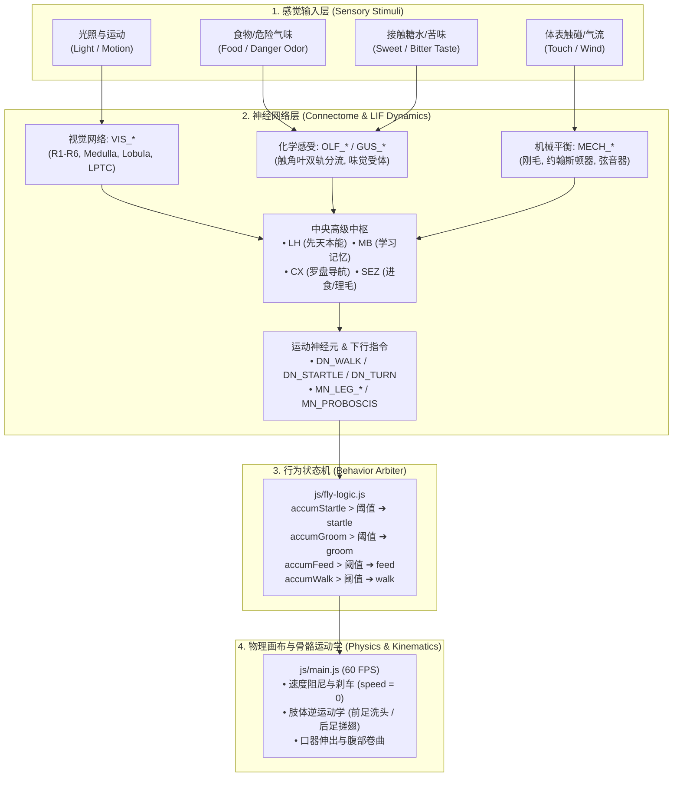
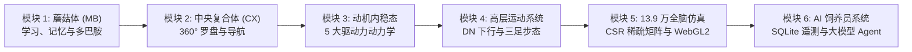

# FlyBrain 感觉神经回路与行为映射学习手册
# FlyBrain Sensory Circuits & Behavioral Kinematics Learning Guide

本文档基于对 FlyBrain 项目中 ~70 个功能神经元连接组的深度分析，系统性记录与总结了果蝇的**四大核心感觉通道（视觉、嗅觉、味觉、机械触觉/平衡觉）**的神经回路拓扑、生物学原型，以及神经脉冲如何驱动底层物理动画与行为状态机。

---

## 目录 (Table of Contents)

1. [总览：感觉输入到行为运动的数据流 (Sensory-to-Behavior Architecture)](#1-总览感觉输入到行为运动的数据流)
2. [第一章：视觉感知回路 (Visual System: `VIS_*`)](#2-第一章视觉感知回路-visual-system-vis_)
3. [第二章：化学感觉系统——嗅觉与味觉 (`OLF_*` & `GUS_*`)](#3-第二章化学感觉系统嗅觉与味觉-olf_--gus_)
4. [第三章：机械触觉、风向平衡与本体感觉 (`MECH_*` & `NOCI`)](#4-第三章机械触觉风向平衡与本体感觉-mech_--noci)
5. [第四章：深度实践案例——`SEZ_GROOM` 理毛回路的端到端实现](#5-第四章深度实践案例sez_groom-理毛回路的端到端实现)
6. [第五章：关键神经元与行为速查对照表 (Reference Table)](#6-第五章关键神经元与行为速查对照表)
7. [第六章：后续进阶学习路线图规划 (Next Learning Roadmap)](#7-第六章后续进阶学习路线图规划)

---

## 1. 总览：感觉输入到行为运动的数据流

果蝇的仿真体系严格遵循“**传感器输入 ➔ 神经网络动力学积分 ➔ 行为状态仲裁 ➔ 物理运动学执行**”的四层架构：



---

## 2. 第一章：视觉感知回路 (Visual System: `VIS_*`)

在 [`js/constants.js`](../js/constants.js#L25-L73) 中，定义了 6 个视觉节点，还原了果蝇视叶（Optic Lobe）由外到内、由浅入深的分层处理。

```
【第 0 层：复眼感光】   VIS_R1R6 (明暗/运动)         VIS_R7R8 (色彩/紫外)
                              │                           │
                              ▼                           ▼
【第 1 层：视神经中继】                  VIS_ME (髓质特征整合)
                                  ┌───────────────┴───────────────┐
                                  ▼                               ▼
【第 2 层：高级特征提取】     VIS_LO (物体与静态地标)           VIS_LPTC (自运动光流/陀螺仪)
                                  │                               │
                                  ▼                               ▼
【第 3 层：行为触发】         VIS_LC (阴影迫近)               CX_EPG / DN_TURN (罗盘朝向校正)
                                  │
                                  ▼
                            DN_STARTLE (弹跳逃逸)
```

### 节点功能与突触连接

1. **`VIS_R1R6`（外周感光细胞，Outer Photoreceptors）**：
   - **生物原型**：小眼周围的 R1–R6 感受细胞，对广谱明暗变化与运动极为灵敏。
   - **连接**：`VIS_ME: 8`（强投射至髓质区），`VIS_LPTC: 4`（直通光流通路），`DRIVE_CURIOSITY: 2`（光照激发白昼探索欲）。
2. **`VIS_R7R8`（中央感光细胞，Inner Photoreceptors）**：
   - **生物原型**：小眼中心的 R7/R8 细胞，专司紫外（UV）和绿光。
   - **连接**：`VIS_ME: 6`，`LH_APP: 4`（先天趋光趋色），`MB_KC: 3`（色彩联想学习）。
3. **`VIS_ME`（髓质区，Medulla）**：
   - 视觉中继中枢，将原始光信号分流为形状通路（`VIS_LO: 7`）、自运动通路（`VIS_LPTC: 6`）与天敌威胁通路（`VIS_LC: 5`）。
4. **`VIS_LO`（小叶区，Lobula）**：
   - 负责识别几何形状与静态地标，投射给蘑菇体（`MB_KC: 4`）形成视觉地标记忆。
5. **`VIS_LC`（小叶柱状神经元，Lobula Columnar）**：
   - **天敌迫近检测器**（Looming Detector）。当阴影在视野中急速扩大时爆发性放电。
   - **连接**：`DN_STARTLE: 12`（超强激发弹跳起飞）、`DRIVE_FEAR: 6`、`DN_FLIGHT: 5`。
6. **`VIS_LPTC`（小叶板大切向神经元，Lobula Plate Tangential Cells）**：
   - 果蝇的**生物陀螺仪**。感知全视野光流（Optic Flow），计算自运动偏航。
   - **连接**：`CX_EPG: 6`（实时校正中央罗盘）、`CX_HDELTA: 5`（偏航修正）、`DN_TURN: 3`（转向补偿）。

---

## 3. 第二章：化学感觉系统——嗅觉与味觉 (`OLF_*` & `GUS_*`)

化学感觉回路实现了**“远程嗅探（Chemotaxis 趋化性）➔ 近距离尝味 ➔ 伸吻进食（Proboscis Extension Reflex）”**。

### ① 嗅觉系统：双轨决策机制

在 [`js/constants.js`](../js/constants.js#L74-L103) 中定义了 4 个节点：

```
【触角外周感受】          OLF_ORN_FOOD (食物香气)      OLF_ORN_DANGER (危险气味)
                                 │                           │
                                 ▼                           ▼
【触角叶侧向抑制】         OLF_LN (局部抑制神经元: 压制背景噪声，突出对比度)
                                 │
                                 ▼
【触角叶投射中枢】                 OLF_PN (投射神经元: 信号分发中继)
                                 ┌──────────────┴──────────────┐
                                 ▼                             ▼
【中央大脑双轨决策】     LH_APP / LH_AV (外侧角)           MB_KC (蘑菇体肯扬细胞)
                      👉【先天本能通道】                 👉【后天学习记忆通道】
```

* **双轨机制核心**：
  1. **外侧角（Lateral Horn, `LH`）**：硬编码的先天直觉。出生即知糖香要靠近（`LH_APP`）、毒气要躲避（`LH_AV`），无需任何后天经验。
  2. **蘑菇体（Mushroom Body, `MB`）**：可塑性学习中枢。气味输入与多巴胺奖惩信号（`MB_DAN`）在此汇聚，形成巴甫洛夫式条件反射。
* **`OLF_LN` 的侧向抑制**：通过 `-2` 的抑制性权重互抑相近通道，强化气味边界，防止复杂气味引起的神经泛化。

### ② 味觉系统：接触进食与奖惩反馈

在 [`js/constants.js`](../js/constants.js#L104-L129) 中：

| 节点代码 | 感受类型 | 核心连接与权重 | 生理与行为后果 |
|---|---|---|---|
| **`GUS_GRN_SWEET`** | 甜味受体 | `SEZ_FEED: 10`<br>`MB_DAN_REW: 7`<br>`DRIVE_HUNGER: -5` | **吻伸出反射**（伸长口器进食）；触发多巴胺奖赏回路；降低饥饿感。 |
| **`GUS_GRN_BITTER`** | 苦味受体 | `SEZ_FEED: -8`<br>`MB_DAN_PUN: 7`<br>`DRIVE_FEAR: 4` | **强力压制进食**（拒食）；触发惩罚性多巴胺通路；诱发惊恐与回避。 |
| **`GUS_GRN_WATER`** | 水受体 | `SEZ_WATER: 8`<br>`SEZ_FEED: 3`<br>`MB_DAN_REW: 3` | 触发饮水行为，轻度兴奋进食回路。 |

### ③ 网页交互与代码闭环（Feed 工具）
当在前端放置食物时：
1. **远距离**（[`js/connectome.js#L315`](../js/connectome.js#L315)）：`BRAIN.stimulate.foodNearby = true` ➔ 激发 `OLF_ORN_FOOD` ➔ 引导果蝇转向并向食物爬行。
2. **接触食物**（[`js/connectome.js#L320`](../js/connectome.js#L320)）：`BRAIN.stimulate.foodContact = true` ➔ 激发 `GUS_GRN_SWEET` ➔ `SEZ_FEED` 兴奋 ➔ 伸出口器舔食。

---

## 4. 第三章：机械触觉、风向平衡与本体感觉 (`MECH_*` & `NOCI`)

果蝇没有外耳廓，全身覆盖着数千根刚毛与微型关节应变器，能够感知声波、气流与自身步态。

在 [`js/constants.js`](../js/constants.js#L130-L156) 中：

### 核心解剖器官与功能

1. **`MECH_BRISTLE`（体表刚毛感受器）**：
   - 遍布头、胸、腹及翅膀表面的机械感觉刚毛。
   - **突触连接**：
     - `SEZ_GROOM: 6` & `DRIVE_GROOM: 4`（触发理毛清洁中枢，推高理毛动机）；
     - `DRIVE_FEAR: 5` & `DN_STARTLE: 7`（突遭触摸引发警惕与弹跳逃跑）。
2. **`MECH_JO`（约翰斯顿器，Johnston's Organ）**：
   - 位于第 2 节触角内部，连接触角芒（Arista），是果蝇的**多功能天线**：
     - 测定风向与气流速度；
     - 感知同伴求偶扑翼声（150–250 Hz 声波共振）；
     - 感知重力。
   - **连接**：`ANTENNAL_MECH: 10`（强投射触角机械中枢）➔ 激活 `CX_HDELTA: 4`（迎风航向校正）与 `DN_TURN: 3`。
3. **`MECH_CHORD`（弦音器，Chordotonal Organs）**：
   - 镶嵌在各足关节内的牵张感受器，提供**本体感觉（Proprioception）**。
   - 在 [`js/connectome.js#L360`](../js/connectome.js#L360) 中，**只要果蝇在走动（`BRAIN._isMoving`），`MECH_CHORD` 就会持续放电**。
   - **连接**：`CX_PFN: 5`（路径积分：实时推算步数与位移）、`CX_FC: 3`（协调三足交替步态）、`DN_WALK: 2`（行走正反馈闭环）。
4. **`NOCI`（伤害感受/痛觉回路）**：
   - 当受到猛烈外力或短时间内遭到连续戳击时触发（[`js/constants.js#L176`](../js/constants.js#L176)）。
   - **连接**：`DN_STARTLE: 10`、`DRIVE_FEAR: 8`、`DN_FLIGHT: 6`、`SEZ_FEED: -5`（剧痛立刻绝食，狂暴逃生）。

---

## 5. 第四章：深度实践案例——`SEZ_GROOM` 理毛回路的端到端实现

以用户在 UI 中使用 **Touch 工具**点击果蝇触发**“停步擦洗头部/翅膀”**为例，展示从用户交互到像素渲染的完整代码流：

### 阶段 1：局部坐标系判定与部位识别
在 [`js/main.js#L900-L919`](../js/main.js#L900-L919)，点击坐标被投影如果蝇自身朝向坐标系（`localX`, `localY`）：
```javascript
if (Math.abs(localX) > 12 && localY > -20 && localY < 5) {
    location = 'leg';
} else if (localY < -17) {
    location = 'head';     // 点中头部
} else if (localY < 2) {
    location = 'thorax';   // 点中胸部
} else {
    location = 'abdomen';  // 点中腹部
}
BRAIN.stimulate.touch = true;
BRAIN.stimulate.touchLocation = location;
```

### 阶段 2：感觉输入累加与敏感区加权
在 [`js/connectome.js#L307-L313`](../js/connectome.js#L307-L313)：
```javascript
if (BRAIN.stimulate.touch) {
    BRAIN.dendriteAccumulate('MECH_BRISTLE');
    // 头部和胸部是高敏防御区，给予双倍刺激剂量
    if (BRAIN.stimulate.touchLocation === 'head' || BRAIN.stimulate.touchLocation === 'thorax') {
        BRAIN.dendriteAccumulate('MECH_BRISTLE');
    }
}
```

### 阶段 3：神经生物学互斥——“理毛必须停步”
在 [`js/constants.js#L304-L312`](../js/constants.js#L304-L312)：
```javascript
SEZ_GROOM: {
    MN_LEG_L1: 10,       // 强力激活左前足运动神经元（洗脸主力）
    MN_LEG_R1: 10,       // 强力激活右前足运动神经元
    MN_ABDOMEN: 5,       // 激活腹部与后足
    MN_HEAD: 4,          // 头部俯仰配合
    DN_WALK: -5,         // 【关键：负权重互斥】强力抑制行走下行神经元！
    DN_FLIGHT: -4,       // 抑制飞行
    SEZ_FEED: -3,        // 抑制进食
}
```
> [!IMPORTANT]
> **生物学互斥（Mutual Inhibition）**：果蝇六足行走依赖三足交替步态。理毛时必须抽取前足或后足离地擦拭，无法维持行走三角，因此理毛中枢必须在神经层面强行切断行走脉冲。

### 阶段 4：状态机仲裁
在 [`js/fly-logic.js#L69-L71`](../js/fly-logic.js#L69-L71)：
```javascript
if (BRAIN.accumGroom > BEHAVIOR_THRESHOLDS.groom && !isCoolingDown('groom', now)) {
    return 'groom'; // 状态机确认为理毛状态
}
```

### 阶段 5：物理减速与停步实现
在 [`js/main.js`](../js/main.js)：
* **目标速度清零**（L1107）：`targetSpeed = 0; speedChangeInterval = -speed * 0.1;`
* **60 FPS 阻尼刹车**（L1140-L1148）：
  ```javascript
  if (behavior.current === 'groom' || ...) {
      if (speed > 0.05) speed *= Math.pow(0.92, dtScale);
      else speed = 0; // 彻底刹停
  }
  ```

### 阶段 6：肢体逆运动学与差异化动画
在 [`js/main.js#L1759-L1772`](../js/main.js#L1759-L1772)，物理引擎根据 `groomLocation` 独立驱动不同腿节：

```javascript
// 1. 擦洗头部：只驱动前足（pairIdx === 0），内收往复擦拭复眼与触角
if (groomLoc === 'head' && pairIdx === 0) {
    hipMod = -0.9 + Math.sin(anim.groomPhase) * 0.4;
    kneeMod = -0.8 + Math.sin(anim.groomPhase * 1.5) * 0.25;
}
// 2. 擦洗腹部/翅膀：只驱动后足（pairIdx === 2），向后刮拭
else if (groomLoc === 'abdomen' && pairIdx === 2) {
    hipMod = 1.0 + Math.sin(anim.groomPhase * 0.8) * 0.3;
    kneeMod = 0.5 + Math.sin(anim.groomPhase * 1.2) * 0.2;
}

// 伴随腹部轻微弯曲配合刷洗 (main.js L1525)
if (behavior.current === 'groom' && behavior.groomLocation === 'abdomen') {
    abdomenCurl = Math.sin(anim.groomPhase * 0.8) * 2;
}
```

---

## 6. 第五章：关键神经元与行为速查对照表

| 感觉通道 | 核心神经元代码 | 生物器官与物理刺激 | 关键下游投射 | 最终行为表现 |
|---|---|---|---|---|
| **视觉** | `VIS_R1R6` | 复眼外周感光（明暗/运动） | `VIS_ME`, `VIS_LPTC` | 初级视觉处理、白昼探索欲 |
| **视觉** | `VIS_R7R8` | 复眼中心感光（色彩/UV） | `VIS_ME`, `LH_APP`, `MB_KC` | 颜色联想学习、趋光趋色 |
| **视觉** | `VIS_LC` | 小叶柱状神经元（迫近阴影） | `DN_STARTLE: 12`, `DRIVE_FEAR: 6` | **紧急起飞逃生（Jump & Escape）** |
| **视觉** | `VIS_LPTC` | 小叶板切向细胞（自运动光流） | `CX_EPG: 6`, `DN_TURN: 3` | **生物陀螺仪、航向自校正** |
| **嗅觉** | `OLF_ORN_FOOD` | 触角气味感受器（食物） | `OLF_PN: 10`, `OLF_LN: 5` | 趋食趋化性转弯与接近 |
| **嗅觉** | `OLF_LN` | 触角叶局部中间神经元 | `OLF_ORN_*: -2` (抑制性) | **侧向抑制、提升气味对比度** |
| **嗅觉** | `OLF_PN` | 触角叶投射神经元 | `LH_APP: 5`, `MB_KC: 8` | **双轨分流：先天本能 vs 记忆学习** |
| **味觉** | `GUS_GRN_SWEET` | 足/口器甜味感受器（糖） | `SEZ_FEED: 10`, `DRIVE_HUNGER: -5` | **吻伸出反射进食、降低饥饿** |
| **味觉** | `GUS_GRN_BITTER`| 足/口器苦味感受器（毒素） | `SEZ_FEED: -8`, `MB_DAN_PUN: 7` | **拒食、激发恐惧与惩罚学习** |
| **机械** | `MECH_BRISTLE` | 体表机械感应刚毛（触碰） | `SEZ_GROOM: 6`, `DN_STARTLE: 7` | **停步洗脸/擦翅；强碰触发惊起** |
| **机械** | `MECH_JO` | 触角约翰斯顿器（风向/声波） | `ANTENNAL_MECH: 10`, `CX_HDELTA: 4` | **迎风转向（Rheotaxis）、抓地抗风** |
| **机械** | `MECH_CHORD` | 足关节弦音器（本体感觉） | `CX_PFN: 5`, `DN_WALK: 2` | **步态节律闭环、航程推算** |
| **痛觉** | `NOCI` | 组织伤害感受器（连续剧烈戳碰） | `DN_STARTLE: 10`, `DRIVE_FEAR: 8` | **剧痛疯狂逃窜、强制绝食** |
| **中枢** | `SEZ_GROOM` | 食道下区理毛指令中枢 | `MN_LEG_L1/R1: 10`, `DN_WALK: -5` | **前足洗头、后足刷翅、抑制行走** |

---

## 7. 第六章：后续进阶学习路线图规划 (Next Learning Roadmap)

目前我们已经完全掌握了**四大感觉输入通道**以及**感觉 ➔ 运动输出的经典端到端闭环**。
为了彻底吃透 FlyBrain 的全脑架构与仿生原理，建议按照以下由浅入深、逻辑递进的 **6 大进阶模块** 展开后续学习：



---

### 模块 1：蘑菇体（Mushroom Body, `MB_*`）—— 昆虫的学习与记忆圣殿
* **核心定位**：探索果蝇如何打破“生而知之”的先天反射，根据后天经历改变突触强度，形成气味联想记忆。
* **重点关注神经元**：
  * `MB_KC`（肯扬细胞，Kenyon Cells）：气味信号的稀疏表征（Sparse Coding）。
  * `MB_DAN_REW` / `MB_DAN_PUN`（多巴胺能神经元）：分别编码糖水奖赏与电击惩罚。
  * `MB_MBON_APP` / `MB_MBON_AV`（蘑菇体输出神经元）：调控果蝇表现出喜好或逃避行为。
* **核心代码与实践目标**：
  * 研读 [`js/constants.js#L187-L225`](../js/constants.js#L187-L225) 蘑菇体回路突触连接；
  * 理解多巴胺如何通过三因子学习法则（Three-factor rule）在毫秒尺度上调制 KC-MBON 突触权重。

---

### 模块 2：中央复合体（Central Complex, `CX_*`）—— 360° 生物指南针与空间导航
* **核心定位**：昆虫的大脑导航仪，解析果蝇如何在无外部地标的情况下推算航程并找到回巢路径（Path Integration）。
* **重点关注神经元**：
  * `CX_EPG`（罗盘神经元，Compass Neurons）：环状吸引子网络（Ring Attractor），其放电活动峰实时指向当前空间航向。
  * `CX_P-EN`：角速度积分器，在果蝇身体旋转时推挤活动峰在环上转动。
  * `CX_PFN` & `CX_HDELTA`：结合本体感觉步数（`MECH_CHORD`）与光流（`VIS_LPTC`）计算位移向量与航向纠偏。
* **核心代码与实践目标**：
  * 研读 [`js/constants.js#L226-L265`](../js/constants.js#L226-L265) 中央复合体各亚区连接；
  * 掌握 Ring Attractor 在点云和画布中的空间朝向映射。

---

### 模块 3：动机内稳态与驱动力动力学（Internal Drives: `DRIVE_*`）
* **核心定位**：动物的行为不仅取决于“看到了什么”，更取决于“想要什么”。研究 5 种内驱力如何作为全局注意力门控动态调节感知。
* **重点关注神经元与变量**：
  * `DRIVE_HUNGER`（饥饿）、`DRIVE_FEAR`（恐惧）、`DRIVE_FATIGUE`（疲劳）、`DRIVE_CURIOSITY`（好奇心）、`DRIVE_GROOM`（理毛欲）。
* **核心代码与实践目标**：
  * 研读 [`js/connectome.js#L170-L245`](../js/connectome.js#L170-L245) 的驱动演化逻辑；
  * 掌握内驱力如何动态调整下游电机的放电阈值（如饥饿时食物气味权重放大，疲劳时进入 `rest` 睡眠状态）。

---

### 模块 4：高层运动指令与六足三足交替步态（Motor & Kinematics）
* **核心定位**：从脑区决策到腹神经索（VNC）物理肌肉收缩的执行链条。
* **重点关注神经元与模块**：
  * `DN_*` 下行指令神经元：`DN_WALK`, `DN_TURN`, `DN_STOP`, `DN_BACKUP`, `DN_STARTLE`, `DN_FLIGHT`。
  * `MN_*` 电机神经元与六足三足交替步态（Tripod Gait）：Group A (L1, R2, L3) 与 Group B (R1, L2, R3) 的 180° 对称摆动相。
* **核心代码与实践目标**：
  * 研读 [`js/constants.js#L323-L368`](../js/constants.js#L323-L368) 与 [`js/main.js#L1700-L1820`](../js/main.js#L1700-L1820)；
  * 掌握三足交替运动学在 Canvas 上的三角函数相位累加（`walkPhase`）。

---

### 模块 5：全脑 13.9 万神经元 CSR 稀疏矩阵与 WebGL2 渲染架构
* **核心定位**：从简化的 ~70 个概念节点跨越到普林斯顿 FlyWire FAFB v783 真实 139,255 神经元的大规模工业级并行仿真。
* **核心代码与实践目标**：
  * 研读 [`js/sim-worker.js`](../js/sim-worker.js)：掌握 CSR（Compressed Sparse Row）稀疏矩阵遍历、Neuropil 局部门控休眠策略及 10Hz 定频仿真；
  * 研读 [`js/neuro-renderer.js`](../js/neuro-renderer.js)：掌握单次 Draw Call 批量绘制 13.9 万粒子、以及基于指数衰减（`BRIGHTNESS_DECAY = 0.82`）平滑插值的 WebGL2 着色器实现。

---

### 模块 6：AI 智能饲养员后端与 LLM 自动化 Agent
* **核心定位**：将全天候生物仿真与大语言模型结合，构建可观测、可预警、可对话的数字生命监控体系。
* **核心代码与实践目标**：
  * 研读 [`server/caretaker.js`](../server/caretaker.js) & [`server/db.js`](../server/db.js)：SQLite 遥测数据落库与自动化事故监测（`scared_the_fly`, `forgot_to_feed`）；
  * 研读 [`server/ai.js`](../server/ai.js) & [`agent/chat-policy.md`](../agent/chat-policy.md)：掌握多模型端点适配（Claude / DeepSeek），以及如何将毫秒级遥测时序注入 Prompt，促使大模型给出精确、带有数值依据的生物学诊断。

